<!-- 
  ============================================
  TEMPLATE PROFILE README GITHUB - TINGGAL EDIT
  Username kamu: prototypeall850-creator

  CARA PAKAI (2 menit):
  1. Buat repo baru dengan nama SAMA PERSIS kayak username kamu:
     prototypeall850-creator/prototypeall850-creator
     -> centang Public + Add a README file
  2. Upload file cover.svg dari folder ini ke repo itu
  3. Copy semua isi file ini ke README.md repo itu
  4. Ganti semua tulisan NAMA KAMU, email, link (cari kata EDIT)
  5. Commit. Selesai, profile kamu langsung berubah.

  Semua bagian ada tanda EDIT biar gampang.
  ============================================
-->

<!-- COVER BANNER -->
<!-- EDIT: kalau upload cover.svg beda path, sesuaikan src nya -->

<!-- TYPING ANIMATION -->
<!-- EDIT: ganti text di baris ?lines= sesuai mau kamu -->

  

  <!-- EDIT: ganti username di semua badge bawah ini kalau beda -->
  
  
  

---

### 👋 Tentang Gua
<!-- EDIT: tulis tentang lo di sini, santai aja -->
Halo! Gua **NAMA KAMU**, developer dari **Indonesia** 🇮🇩.

- 🔭 Lagi ngerjain: **EDIT: contoh -> SaaS dashboard + AI chatbot**
- 🌱 Lagi belajar: **EDIT: contoh -> Next.js 15, Go, Docker**
- 👯 Pengen kolab di: **EDIT: contoh -> Open source, UI library**
- 💬 Tanya gua soal: **EDIT: React, Tailwind, Firebase**
- 📫 Hubungi: **email@kamu.com** <!-- EDIT -->
- ⚡ Fun fact: **EDIT: ngoding paling lancar jam 11 malam + kopi**

---

### 🛠️ Tech Stack
<!-- EDIT: hapus/tambah badge sesuai stack lo. List lengkap: https://shields.io -->

  
  
  
  
  
  
  
  

<!-- VERSI ICON OTOMATIS (alternatif, lebih rapi) -->

  

---

### 📊 Statistik GitHub
<!-- EDIT: semua udah otomatis pakai username kamu, gak perlu diubah kecuali mau ganti tema -->
<!-- Tema lain: tokyonight, dracula, github_dark, radical, gruvbox, onedark -->

  
  

  
  

  

---

### 🚀 Projek Pilihan
<!-- EDIT: ganti dengan repo asli lo. Cara: ganti username + nama repo -->

  
  

---

### 📫 Connect Sama Gua
<!-- EDIT: ganti semua link bawah -->

  
  
  
  

---

  
   
  <i>⭐ Dari <a href="https://github.com/prototypeall850-creator">NAMA KAMU</a> — thanks udah mampir!</i>

